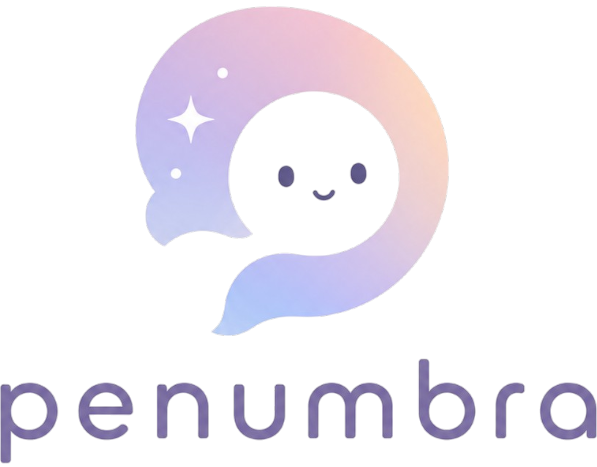

<div align="center">
  

  <h3>Mental-health early-detection, with care built in</h3>
  <p>Reddit posts → MentalBERT classification → MongoDB → RAG/CAG chatbot + consent-gated emergency-contact alerts</p>

  <p>
    
    
    
    
  </p>
</div>

---

## What is Penumbra?

Penumbra reads a person's **public Reddit activity**, classifies each post for mental-health
severity with a fine-tuned **MentalBERT** model, and presents a calm, supportive dashboard:
a severity trend, a reflective **RAG chatbot**, and — only at the highest severity and only
with consent — a way to reach the people that person chose as their support network.

It is deliberately conservative about privacy and harm:

- A **crisis-keyword check runs before** the classifier, so explicit crisis language escalates immediately.
- The chatbot **reflects and asks** — it never diagnoses or gives directive advice, and always points toward a professional.
- Outgoing emails carry **no diagnosis, no score, no post text, and never the Reddit username** — only a display name the user chose.
- Contacts must **double opt-in** before they can receive anything beyond a generic check-in.

> ⚠️ Penumbra is a research/educational project for **early awareness, not diagnosis or surveillance**, and is not a medical or crisis service.

---

## Key features

- 🔐 **Reddit login + on-login ingestion** — sign in with a Reddit username; the backend pulls
  your **last 90 days** of public posts (app-only OAuth), cleans + PII-scrubs them, and keeps
  only mental-health-relevant subreddits (via a subreddit taxonomy). A full user-OAuth
  (`identity`) code path is also included.
- 🧠 **Severity classification** — MentalBERT's 7 classes → 4 tiers, aggregated with a
  **recency-weighted** score so recent posts matter more.
- 💬 **RAG + CAG chatbot** — grounds replies in a mental-health knowledge base **and** the
  user's own recent posts + relevant past conversations; an in-memory **cache (CAG)** serves
  the current session. OpenAI primary with an automatic **Groq fallback**.
- 📊 **Analytics dashboard** — severity-over-time, severity breakdown, and a post-activity heatmap.
- 🆘 **Consent-gated alerts** — at Critical severity, optional check-ins to user-chosen contacts,
  gated by double opt-in; emails never reveal clinical details or the Reddit handle.
- 🌱 **Energy/carbon analysis** — a CodeCarbon-based script measuring the pipeline's footprint.

---

## How it works

```
Reddit login ──▶ ingest (last 90d) ──▶ clean + PII scrub ──▶ MongoDB ──▶ MentalBERT ──▶ severity
 (username / OAuth)                      (taxonomy filter)    (posts/users)  (7 → 4 tiers, recency-weighted)
                                                                                  │
                          ┌───────────────────────────────────────────────────────┤
                          ▼                                ▼                        ▼
                   Dashboard                        RAG/CAG chatbot          Response engine
            (trend · breakdown · heatmap)   (KB + own posts + chat history)   (helplines + consent-gated alerts)
```

---

## Tech stack

| Layer | Technology |
|---|---|
| Backend | FastAPI, Motor (async MongoDB), Pydantic v2 / pydantic-settings |
| NLP | `aiguanai/mentalbert-mental-health-v2` (HuggingFace), Transformers, PyTorch |
| Ingestion | asyncpraw (read-only Reddit), langdetect, markdown/PII cleaning |
| RAG | Pinecone (or MongoDB Atlas `$vectorSearch`), `all-MiniLM-L6-v2` embeddings |
| LLM | OpenAI `gpt-4o-mini` (primary) with OpenAI-compatible fallback (e.g. Groq) |
| Frontend | Next.js 16 (App Router) + React 19, TypeScript, Tailwind v4, Framer Motion, Recharts, React Flow |
| Email | SMTP (Gmail) for alerts + double opt-in consent |
| Energy | CodeCarbon |

### Severity model

| MentalBERT label | Tier |
|---|---|
| Normal | Low |
| Anxiety, Stress | Medium |
| Depression, Bipolar, Personality disorder | High |
| Suicidal | Critical |

---

## Quickstart

> Full prerequisites, configuration, and troubleshooting are in **[SETUP.md](SETUP.md)**.

```bash
# 1. Backend (port 8002)
python -m venv venv
venv\Scripts\activate            # macOS/Linux: source venv/bin/activate
pip install -r requirements.txt
copy .env.example .env           # macOS/Linux: cp .env.example .env
#   then fill in MONGODB_URI, OPENAI_API_KEY, (optional) REDDIT_*, PINECONE_* …
uvicorn backend.main:app --reload --reload-dir backend --port 8002

# 2. Frontend (port 3000)
cd frontend
npm install
npm run dev
```

Open <http://localhost:3000>.
- **Continue with Reddit** → enter a Reddit username to load that user's real public posts.
- **Demo accounts** (`u001`–`u004`) bypass login and go straight to a dashboard.

### Minimal `.env`

```bash
MONGODB_URI=mongodb+srv://<user>:<pwd>@<cluster>.mongodb.net/?retryWrites=true&w=majority
MONGODB_DB=mental_health_db
OPENAI_API_KEY=sk-...

# Reddit (read-only app credentials enable real ingestion on login)
REDDIT_CLIENT_ID=
REDDIT_CLIENT_SECRET=
REDDIT_USER_AGENT=python:penumbra:1.0.0 (by /u/<your_username>)
REDDIT_RECENT_WINDOW_DAYS=90

# RAG retrieval (optional but recommended)
PINECONE_API_KEY=
PINECONE_INDEX=

# Optional fallback LLM (used only if OpenAI errors, e.g. quota)
FALLBACK_API_KEY=
FALLBACK_BASE_URL=https://api.groq.com/openai/v1
FALLBACK_MODEL=meta-llama/llama-4-scout-17b-16e-instruct
```

`.env` is git-ignored — never commit it. Only `.env.example` (placeholders) belongs in git.

---

## The dashboard

Four tabs, sharing one load (no per-tab refetch):

- **Overview** — severity-breakdown donut + post-activity heatmap, and a severity-over-time trend.
- **Posts** — every classified post; click for the full text.
- **Actions** — recommended steps, helplines, support network, and the Critical crisis flow.
- **Settings** — display name, contacts, consent toggles, danger zone.

A floating chat widget (bottom-right) is available on every tab.

---

## Energy & carbon analysis

`energy_analysis/` measures the electricity (Wh) and CO₂ of *obtaining* a result — model load,
per-post classification, embeddings, and a literature-based estimate for the (remote) LLM reply.
It uses **CodeCarbon**, which auto-detects your CPU's power and your grid's carbon intensity.

```bash
pip install -r energy_analysis/requirements-energy.txt
python energy_analysis/measure_energy.py --reps 5 --seconds 20 --country IND
```

Outputs a paste-ready `energy_analysis/results/energy_report.md` plus JSON/CSV. See
[energy_analysis/README.md](energy_analysis/README.md).

---

## Repository layout

```
backend/        FastAPI app — routers, services (NLP, RAG, ingestion, email), schemas
frontend/       Next.js dashboard (App Router, TypeScript)
data/           mental-health knowledge base + subreddit taxonomy + demo posts
energy_analysis/ CodeCarbon energy/carbon measurement
src/ · config/ · scripts/   standalone Reddit ingestion + privacy pipeline (Fernet PII vault,
                 mh_raw/mh_pii) — runnable independently of the app
```

---

## Documentation

- **[SETUP.md](SETUP.md)** — install, configure, run, and troubleshoot.
- **[CLAUDE.md](CLAUDE.md)** — deep reference: model-loading chain, RAG/CAG guardrails, response
  engine, MongoDB schema, full API surface, and known gotchas.

## Demo users

| ID | Username | Severity |
|---|---|---|
| u001 | user_alpha | Critical |
| u002 | user_beta | Low |
| u003 | user_gamma | High |
| u004 | user_delta | Medium |

---

<div align="center">
  <sub>Built for early support, not surveillance. If you or someone you know is in crisis, contact a local helpline — in India, Tele-MANAS at <b>14416</b>.</sub>
</div>
